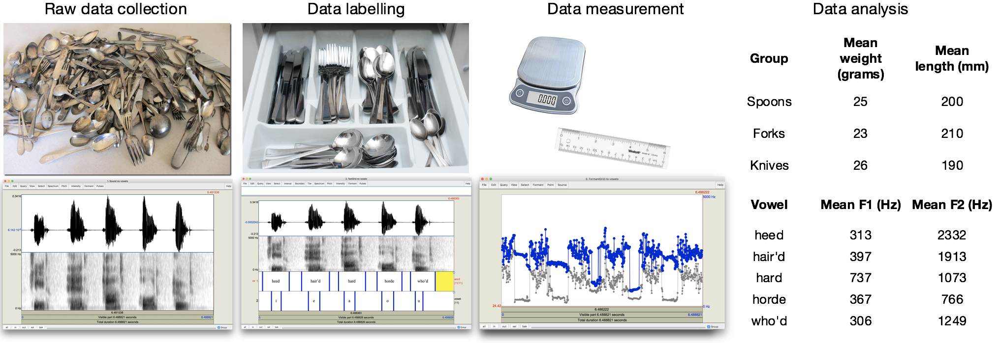
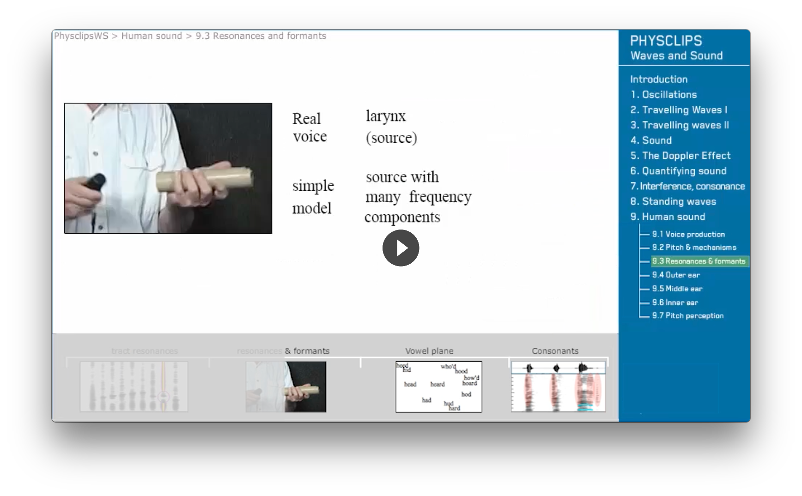
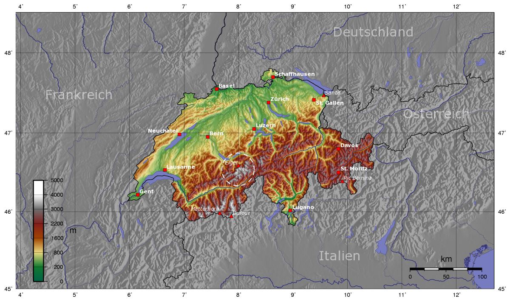

```{r setup, include=FALSE}
library(knitr)
library(tufte)
library(dplyr)
library(readr)
library(ggplot2)

cox2006means <-
    read_csv("data/table_COX2006_formants.csv") %>%
    filter(stat == "mean") %>% 
    select(Group = sex, Vowel = vowel, F1_average = f1_target1, F2_average = f2_target1) %>%
    filter(Vowel %in% c("FLEECE", "SQUARE", "BATH", "THOUGHT", "GOOSE")) %>%
    rowwise %>% 
    mutate(Vowel = switch(Vowel,
                          `FLEECE`  = "heed",
                          `SQUARE`  = "hair'd",
                          `BATH`    = "hard",
                          `THOUGHT` = "horde",
                          `GOOSE`   = "who'd"),
           Group = ifelse(Group == "male", "AusE male avg.", "AusE female avg."))

# For some reason Tufte side notes don't show up with 'runtime: shiny' but margin notes do
# workaround for side notes piggybacking on margin notes function from tufte package
side_note_count <- 0

side_note <- function(note) {
    new_count <- get("side_note_count") + 1
    side_note_count <<- new_count
    sup_text  <- paste0("<sup>", new_count,"</sup>")

    paste0(sup_text, margin_note(paste0(sup_text, note)))
}
```

# About

This workshop is designed for people with little experience in using Praat—a cross-platform, open-source phonetics program which assists in the recording, annotation, and analysis of speech sounds. Through the completion of short exercises, participants will be guided through a simple phonetics project from the recording stage to the report-writing stage.

In particular, we will 1) use Praat to record English vowels in /hVd/ environments (e.g. heed, hard, hair'd, horde, who'd), 2) learn to identify and label the vocalic components within the speech signal, 3) extract data of these vowels into tables for analysis, 4) produce relevant graphics both in Praat and a spreadsheet program (e.g. Google Sheets, or Excel), and 5) produce a brief report of the vowels, based on a supplied document template.

No practical experience with acoustic phonetics is assumed, though some basic familiarity of linguistics and speech production is preferred (e.g. completed a LING101 course). Participants should come with a laptop and with Praat downloaded and installed.`r margin_note("Download links: [MacOS](http://www.fon.hum.uva.nl/praat/download_mac.html), [Windows](http://www.fon.hum.uva.nl/praat/download_win.html), [Linux](http://www.fon.hum.uva.nl/praat/download_linux.html)")`

## What are phonetics analyses anyway?

Praat assists us in carrying out phonetic analyses of speech sounds, but just what are phonetic analyses anyway? Roughly stated, they are comparisons of acoustic measurements between two or more groups of speech sounds, and Praat helps us deal with the practicalities of grouping speech sounds of interest (e.g. word-initial vs. word-medial vowels, interrogative vs. declarative sentences), and extracting acoustic measurements of interest (e.g. pitch, intensity, formant structure) for comparison.

<figure style="width:900px">

</figure>

## Goal: A short report of your vowels

The goal of the workshop will be to produce a short report with 4 sections (described below in the side notes). Don't worry if you don't understand all of the vocabulary in the report text—you'll be familiar with them by the end of the workshop!

> In this report, we compare first and second formant averages of five vowels reported for Australian-English speakers in @cox2006acoustic with averages collected from a participant NS, a 28-year-old male Burmese-English bilingual.`r side_note("Describe the aim of your analysis and participant information.")`
> We recorded five words in the /hVd/ context (*heed, hard, horde, who'd, hair'd*) using the built-in microphone on a 2016 Macbook Pro in a relatively quiet meeting room at the Australian National University.`r side_note("Describe items recorded and recording environment.")`

> The vowels were annotated in the Praat Editor Window with only the spectrogram visible (pitch, intensity, and formant contours were turned off), and using the default spectrogram settings (View range: 0-5000 Hz, Window length: 0.005, Dynamic range: 70 dB).`r side_note("Describe annotation environment and annotation criteria.")`
> As illustrated in the figure below, the starts of vowels were placed at the beginning of low frequency components (indicating the end of the voiceless fricative /h/), and the ends of vowels were placed at the termination of high frequency components (signalling the start of the stop closure /d/).

<figure style="width:550px">

</figure>

> The calculated formant averages were located on a F1-F2 plane along with average values for AusE male and female speakers from @cox2006acoustic. As observed in the figure below, the acoustic data indicated that NS's <em>heed</em> vowel was produced in a location effectively identical to the AusE Male average, while their <em>who'd</em> was relatively more backed than both the AusE female and male averages.`r side_note("Produce vowel plot, and make some observations.")`

```{r ns-vowels, echo=FALSE, fig.width=10, fig.height=8}
cox2006means %>%
    rbind(data.frame(
        stringsAsFactors = FALSE,
        Group       = "NS",
        Vowel      = c("heed", "hard", "horde", "who'd", "hair'd"),
        F1_average = c(313, 737, 367, 306, 397),
        F2_average = c(2332, 1073, 766, 1249, 1913)
    )) %>% 
    
    ggplot(aes(x = F2_average, y = F1_average)) +
    geom_text(aes(label = Vowel, color = Group), size = 7, show.legend = FALSE) +
    geom_point(aes(color = Group)) +
    scale_x_reverse() +
    scale_y_reverse() +
    theme_bw(base_size = 16) +
    xlab("Second formant average") +
    ylab("First formant average") +
    ggtitle("A comparison of vowel formants from 5 /hVd/ words")
```

# Some background

## Vocal tract configuration and formant variation

All the theory you need for this workshop can be found in an excerpt from Joe Wolfe's excellent video "Resonances & Formants" (1m17s to 2m32s):

<a class="no-underline" href="https://vimeo.com/user39455028/resonanceandformants#t=77s" target="_blank">

</a>

I provide here a transcript of the excerpt (emphasis mine):

<blockquote>
Here's a simplified demonstration, I have a source with many different frequency components present, and a flexible tube. If I change the geometry of the tube, I change the frequencies of its resonances, and so change the formants.

If I open my mouth more, the tract is a bit more like a cone than a cylinder, so the first resonance rises; [...and] conversely [falls], if I close it. <b>So the mouth opening largely determines the first resonance and the formant</b>.

<b>Whether the tongue constriction is forward or back strongly influences the second resonance</b>.

<b>The vowels are traditionally located on a plot of mouth opening versus tongue position, which is almost the same as a plot of first formant versus second, with the axes reversed</b>.

</blockquote>

## What is a spectrogram anyway?

Before we define what a spectrogram is, let's have a look at the Swiss Alps! The figure below shows, separately, the height of various mountain peaks (e.g. Eigner: 3970 m) and their geographical location on Google Maps.

<figure style="width:900px">

</figure>

One way that we can incorporate altitude information into a map is to use a color gradient to indicate the metres above sea level. For example, we can see a small patch of white in the circle below, indicating the group of mountain peaks well above 3000 m.

<figure style="width:800px">

</figure>

Now, let's start by looking at two spectral slices, graphs indicating how much sound energy was detected (y-axis) for various frequencies (x-axis) at some given point in time:

<figure style="width:600px">

</figure>

Notice above how Slice B has a bigger bump at the start, compared to Slice A? In other words, there's more acoustic energy at the lower frequencies in Slice B than in Slice A.
We see this in the spectrogram as the dark band at the bottom of Slice B, and the relative lightness at the bottom of Slice A. So, just as a terrain map indicates how altitude varies by latitude and longitude, a spectrogram indicates how sound energy varies by frequency and time.`r margin_note('<br ><br ><br ><br >')`

<figure style="width:600px">

</figure>


# Exercises

## Recording your vowels

1. Write down the words to be recorded (it's much easier!), and do feel free to swap the order:
    - Heed
    - Hair'd
    - Hard
    - Horde
    - Who'd

2. Open up Praat, and from the top left menu item '`New`', click `Record mono Sound...` which will open the `SoundRecorder` in a separate window.
3. Click `Record` to begin recording your vowels and `Stop` to finish
    - Pause for a bit between each word, and also give a second or so before and after your word list in order to make sure you capture all the words.
    - Press `Play` to playback the most recent recording, or `Record` again to overwrite it.
4. When you're happy with the recording, give the sound file a name (e.g. `my_vowels`) in the `Name` field in the bottom right corner of the `SoundRecorder` window, and then press `Save to list & Close`. You will see your recording (e.g. '`1. Sound my_vowels`') in the list of `Objects`.

## Annotating your vowels

1. Select your Sound in the `Objects` list (e.g. `1. Sound my_vowels`), or if you had pre-recorded your vowels before the workshop, click `Open` then `Read from file...`.
2. Click the `Annotate - ` button then `To TextGrid...`, and enter the values below:
    
3. In `Objects` list, select both your TextGrid and Sound files (Command + Click for MacOS, Control + Click for Windows), and then click `View & Edit`
4. Now we're ready to annotate! We're going to get you used to using shortcuts in Praat (Command for MacOS, Ctrl for Windows):
    - Cmd + N: Zoom to selection
    - Tab: Play selection
    - Cmd + 1: Add interval on tier 1
    - Cmd + A: Show all
    
<a class="no-underline" target="_blank" href="http://recordit.co/ea8cT2yVce">`r margin_note("Click the animated image to view the video which you can play/pause to follow it at your own pace.")`

</a>

## Data extraction

We're going to do this step twice. Once manually, and then once semi-automatically with Google Sheets.`r side_note("If you're really keen and are familiar with R, you can also do this step in R!")` By the end of this stage, however you do it, you should have a table as the one shown below. Go to the [plot interface](#section-plotting-your-vowels) to make an F1-F2 plot with these values.

<figure style="width:500px">
|Vowel  | F1_average| F2_average|
|:------|----------:|----------:|
|heed   |        313|       2332|
|hard   |        737|       1073|
|horde  |        367|        766|
|who'd  |        306|       1249|
|hair'd |        397|       1913|
</figure>

### Manually from the Praat Editor window

1. If your formant contours are turned off, click the `Formant` menu then `Show formants`
2. Select a vowel interval you have previously annotated, then click the `Formant` menu and then `Get first formant`. The `Praat Info` window will then appear with the mean first formant of within interval, note the value down somewhere (in a text editor, or on a piece of paper).

<a class="no-underline" target="_blank" href="http://recordit.co/nPzmMgZeJ5">`r margin_note("Click the animated image to view the video which you can play/pause to follow it at your own pace.")`

</a>

### Extracting data using Google Sheets

1. Export TextGrid data as `annotations.csv` and Formant data as `formants.csv`.

<a class="no-underline" target="_blank" href="http://recordit.co/ybhGxsf99a">`r margin_note("Click the animated image to view the video which you can play/pause to follow it at your own pace.")`

</a>

2. Import `annotations.csv` and `formants.csv` into Google Sheets, ticking the option of `Replace current sheet` for the first one, and then `Inset new sheet(s)` for the second one.`r side_note("If you'd prefer to do these next steps in R, here's the code: [https://git.io/vbfQ2](https://git.io/vbfQ2).")`

<a class="no-underline" target="_blank" href="http://g.recordit.co/euy7g7MxHl.gif">`r margin_note("Click the animated image to view the video which you can play/pause to follow it at your own pace.")`

</a>

3. From the `annotations` sheet, query the `formants` sheet using the `QUERY()` function:

    ```
    =QUERY(formants!A:C, "select avg(C) where A >= 0.42 and A <= 0.74 label avg(C) ''", 1)
    ```


4. Or, use the `&` to concatenate in values from the `annotations` sheet:

    ```
    =QUERY(formants!A:C, "select avg(C) where A >= " & A2 &" and A <= " & D2 & " label avg(C) ''", 1)
    ```

## Plotting your vowels

Enter in the mean F1 and F2 values you have extracted to plot them against the average F1 and F2 values of AusE male and female speakers.

```{r vowel plot app, echo=FALSE}
inputPanel(
    textInput("group_label", "Initials", value = "NS"),
    
    numericInput("heed_f1", "Heed, mean F1", 200),
    numericInput("heed_f2", "Heed, mean F2", 2500),
    
    numericInput("hard_f1", "Hard, mean F1", 700),
    numericInput("hard_f2", "Hard, mean F2", 1200),
    
    numericInput("horde_f1", "Horde, mean F1", 400),
    numericInput("horde_f2", "Horde, mean F2", 800),
    
    numericInput("whod_f1", "Who'd, mean F1", 300),
    numericInput("whod_f2", "Who'd, mean F2", 1600),
    
    numericInput("haird_f1", "Hair'd, mean F1", 400),
    numericInput("haird_f2", "Hair'd, mean F2", 1900)
)

renderPlot({
    
cox2006means %>%
    rbind(data.frame(
        stringsAsFactors = FALSE,
        Group       = input$group_label,
        Vowel      = c("heed", "hard", "horde", "who'd", "hair'd"),
        F1_average = c(input$heed_f1, input$hard_f1, input$horde_f1, input$whod_f1, input$haird_f1),
        F2_average = c(input$heed_f2, input$hard_f2, input$horde_f2, input$whod_f2, input$haird_f2)
    )) %>% 
    ggplot(aes(x = F2_average, y = F1_average)) +
    geom_text(aes(label = Vowel, color = Group), size = 8, show.legend = FALSE) +
    geom_point(aes(color = Group)) +
    scale_x_reverse() +
    scale_y_reverse() +
    theme_bw(base_size = 20) +
    xlab("Second formant average") +
    ylab("First formant average") +
    ggtitle("A comparison of vowel formants from 5 /hVd/ words")
    
}, height = 700, width = 800)
```

# Bibliography

<!-- Extra non-content things //-->

<link rel="stylesheet" href="https://maxcdn.bootstrapcdn.com/font-awesome/4.7.0/css/font-awesome.min.css">

<style type="text/css">
html { margin-top: 150px; }
body { background: white; padding-left:5%; width:95% }

ol, ul { width: inherit } /* Remove defined width for lists within lists */

@media only screen and (min-width: 700px) {
    div > ul, div > ol { width: 45% } /* Re-add width for top-level lists */
}

a.no-underline {
    border: 0;
    background: none;
    text-shadow: none;
}

.form-group {
    font-family: sans serif;
}

/* I'm hijacking Markdown's **X** -> <strong>X</strong> conversion to write IPA */
@import url('https://fonts.googleapis.com/css?family=Noto+Sans');
strong { font-family: 'Noto Sans', sans-serif; font-weight: normal }
strong::before { content: '[' }
strong::after  { content: ']' }

/* Copied from http://tholman.com/github-corners/ */
.github-corner:hover .octo-arm{animation:octocat-wave 560ms ease-in-out}@keyframes octocat-wave{0%,100%{transform:rotate(0)}20%,60%{transform:rotate(-25deg)}40%,80%{transform:rotate(10deg)}}@media (max-width:500px){.github-corner:hover .octo-arm{animation:none}.github-corner .octo-arm{animation:octocat-wave 560ms ease-in-out}}
</style>


<a href="https://github.com/CoEDL/vyov" title="View source on Github" class="github-corner" aria-label="View source on Github"><svg width="80" height="80" viewBox="0 0 250 250" style="fill:#151513; color:#fff; position: absolute; top: 0; border: 0; right: 0;" aria-hidden="true"><path d="M0,0 L115,115 L130,115 L142,142 L250,250 L250,0 Z"></path><path d="M128.3,109.0 C113.8,99.7 119.0,89.6 119.0,89.6 C122.0,82.7 120.5,78.6 120.5,78.6 C119.2,72.0 123.4,76.3 123.4,76.3 C127.3,80.9 125.5,87.3 125.5,87.3 C122.9,97.6 130.6,101.9 134.4,103.2" fill="currentColor" style="transform-origin: 130px 106px;" class="octo-arm"></path><path d="M115.0,115.0 C114.9,115.1 118.7,116.5 119.8,115.4 L133.7,101.6 C136.9,99.2 139.9,98.4 142.2,98.6 C133.8,88.0 127.5,74.4 143.8,58.0 C148.5,53.4 154.0,51.2 159.7,51.0 C160.3,49.4 163.2,43.6 171.4,40.1 C171.4,40.1 176.1,42.5 178.8,56.2 C183.1,58.6 187.2,61.8 190.9,65.4 C194.5,69.0 197.7,73.2 200.1,77.6 C213.8,80.2 216.3,84.9 216.3,84.9 C212.7,93.1 206.9,96.0 205.4,96.6 C205.1,102.4 203.0,107.8 198.3,112.5 C181.9,128.9 168.3,122.5 157.7,114.1 C157.9,116.9 156.7,120.9 152.7,124.9 L141.0,136.5 C139.8,137.7 141.6,141.9 141.8,141.8 Z" fill="currentColor" class="octo-body"></path></svg></a>

<script type="text/javascript">
    // Had no idea how to set a 
    document.title = 'VYOV: Visualise your own vowels'
</script>
